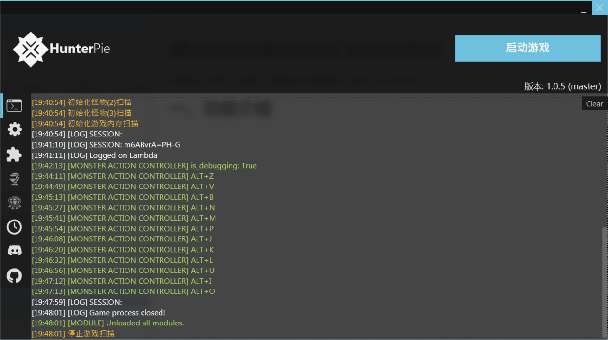
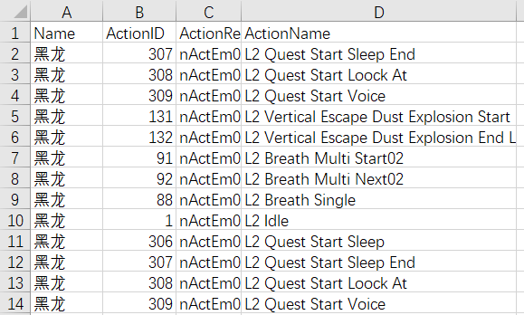
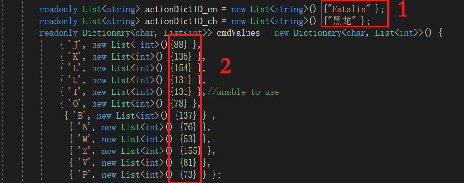
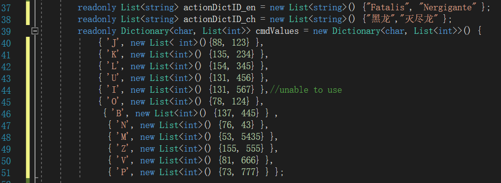
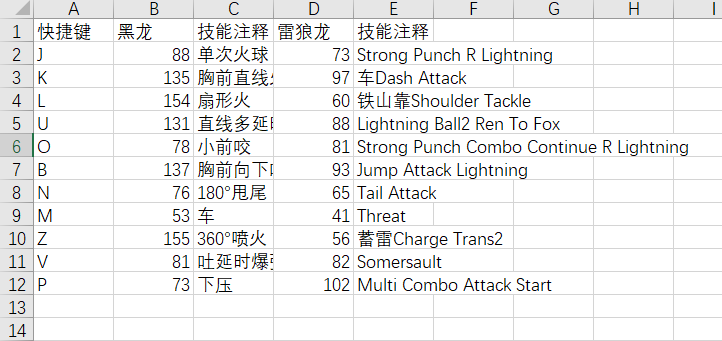

# MonsterActionController（更新到2.0）

怪物猎人世界（冰原）怪物动作控制插件（基于HunterPie）

**警示：本插件只推荐用于开黑娱乐，请勿用于野队破坏他人游戏体验。**

插件联机可用，但仅限房主使用，其他队伍成员使用大概率掉线。

bilibili演示效果：https://www.bilibili.com/video/BV1xv411K7uk

## 一、功能介绍

HunterPie作为一款操作简便的显血软件被猎人们广泛使用，不过它实际上对整个怪猎的内存进行了分析，也提供了便利的接口供二次开发。本插件就是在其提供的接口上开发出的怪物出招控制插件。

**关于插件安装：**将`MonsterActionController.dll`和`module.json`拖入`<HunterPie目录>\Modules\MonsterActionController`文件夹中即可。若需要修改脚本，则将`MonsterActionController.cs`和`module.json`拖入，每次HunterPie启动时会编译脚本。

### 1）基础使用

插件通过快捷键使用，目前只对黑龙的动作进行了适配，不过我提供了简便的方法供使用者拓展，也欢迎所有人提交其他怪物的适配。

目前版本限全图只有一个怪物的情况，**使用对应快捷键会锁定使用该技能，按下Alt+S中止**，也可以直接按其他技能快捷键切换其他技能。目前支持了黑龙、雷狼龙的快捷键，下面以黑龙为例：

| 快捷键 | 技能/功能      | 游戏内技能代号/详述                                          |
| ------ | -------------- | ------------------------------------------------------------ |
| Alt+D  | 启用Debug      | 开启数据保存，怪物的出招和对应的数字代号将保存到HunterPie同级的Actionlog.csv中 |
| Alt+T  | 切换怪物       | 在所有适配的怪物之间切换，控制台会显示当前怪物。             |
| Alt+S  | 停止锁招       | 按下后停止控制怪物出招                                       |
| Alt+E  | 骑乘           | 需要先积累至少1点骑乘值，如虫棍空中攻击                      |
| Alt+J  | 单次火球       | 88 / L2 Breath Single                                        |
| Alt+K  | 胸前直线火     | 135 / L2 Line Fire Shoot                                     |
| Alt+L  | 扇形火         | 154 / L2 Special Wide Range Fire Shoot                       |
| Alt+U  | 直线多延时爆弹 | 131 / L2 Vertical Escape Dust Explosion Start                |
| Alt+O  | 小前咬         | 78 / L4 Short Bite                                           |
| Alt+B  | 胸前向下吐息   | 137 / L2 Under Breath                                        |
| Alt+N  | 180°甩尾       | 76 / L2 Tail Swing                                           |
| Alt+M  | 车             | 53 / L4 Rush Start                                           |
| Alt+Z  | 360°喷火       | 155 / L4 All Angle Breath                                    |
| Alt+V  | 吐延时爆弹     | 81 / L2 Quick Breath                                         |
| Alt+P  | 下压           | 73 / L2 Switch L4 Body Press                                 |

### 2）拓展（看下面2.0版本）

如果你想要控制其他怪物，需要**自行找到该怪物技能对应的ActionID**，此节简单讲解插件原理，并讲述拓展适配的方法。

#### **原理**（可以不看）

MHW怪物出招由一个int型的**ActionID**控制，当怪物一个技能放完会根据此ID进行下一动作，不过怪物**AI会根据情况不同不断更新这个值**，导致简单的一次修改ActionID并不能控制其出招，即使是CE的内存锁定频率也太低，实测不能达到效果。HunterPie在游戏中提供了怪物技能实时显示，自然也给出了ActionID的内存位置（具体位置`actionPointer = MonsterAddress + 0x61C8 + 0xB0`），我们通过开一个线程用**while循环高频向此地址写入**想要的技能，即可达到目的，而Alt+S快捷键的作用便是中止该线程的运行。

#### 如何拓展其他怪物

拓展一个怪物可能用不上二十分钟的时间，**流程非常简洁**。

**按下Alt+D快捷键开启数据自动保存**，和目标怪物进行一场狩猎，怪物的出招和对应的数字代号将保存到HunterPie同级的Actionlog.csv中，格式如下：

（ActionName可能不是很好理解，不过HunterPie在狩猎中会在怪物部件显示当前出招，留心一下需要的技能名称即可，在表中找到对应的ActionID进行下一步。）

**MonsterActionController.cs的37-52行**是拓展需要关注的内容，如果你有任何语言编程基础，那么看懂此段C#代码应该很轻松，如果没有也只需要按照下述操作即可：

**区域1**代表怪物名称，该名称只是在切换怪物时给用户看的，并不需要切合正规名称，但务必保证数量正确。

**区域2**代表ActionID，如`'J'`右边花括号里代表`Alt+J`快捷键锁定的技能，将拓展的ActionId（也就是excel表第二列内容）补充到花括号里即可，每一列对应上面名称的每一个。

**以添加灭尽龙为例**：（ActionID是瞎编的）

**总结起来只有三步：**

1. Alt+D打开Debug模式，和目标怪物进行一次狩猎。
2. 查看Actionlog.csv，挑选需要的ActionID
3. 将ActionID填入MonsterActionController.cs的对应位置
4. 重启HunterPie即可

## 二、2.0版本

**新特性：**

1. **第一龙称狩猎：骑龙控招，沉浸感MAX**
2. **大幅简化拓展流程，轻松添加其他怪物**
3. **增加按键提示音**
4. **增加反插件刷片机制，维护游戏环境**

### 拓展部分

现在拓展只需要打开`HunterPie\Modules\MonsterActionController\actions.csv`表格，**在里面添加即可，不需要修改源代码。**

每一个龙**占两列**，技能注释那列**每个单元至少有一个字符，不要包含英文逗号**

### 2.1版本

1. **解决了骑乘快捷键第二次骑乘不上去的BUG**，现在只要**积累至少1点骑乘值**后，任何时候按Alt+E即可直接骑乘
2. 优化了中文编码，actionlog.csv不会乱码了
3. 雷狼龙的快捷键稍微做了调整
