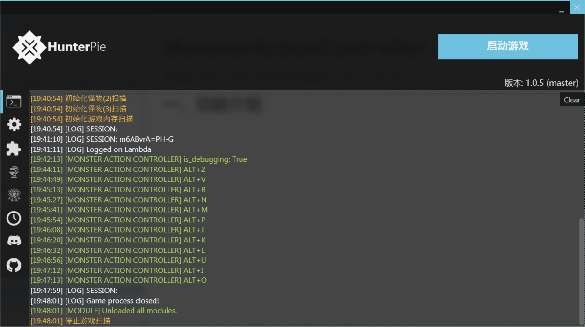
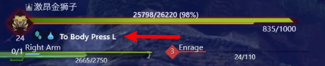

# MonsterActionController

怪物猎人世界（冰原）怪物动作控制插件（基于HunterPie）

**警示：本插件只推荐用于开黑娱乐，请勿用于野队破坏他人游戏体验。**

插件联机可用，但仅限房主使用，其他队伍成员使用大概率掉线。

bilibili演示效果：https://www.bilibili.com/video/BV1xv411K7uk

项目地址：https://github.com/WLLEGit/MHW-MonsterActionController



HunterPie作为一款操作简便的显血软件被猎人们广泛使用，不过它实际上对整个怪猎的内存进行了分析，也提供了便利的接口供二次开发。本插件就是在其提供的接口上开发出的怪物出招控制插件。

## 插件安装

### 正常安装

1. 下载Hunterpie v1: https://www.nexusmods.com/monsterhunterworld/mods/2645
2. 将`<HunterPie目录>\address`目录下的`MonsterHunterWorld.421631.map`复制一份，改名为`MonsterHunterWorld.421740.map`，放在同一文件夹下
   - 如果后续怪猎又有更新，421740这个数字会变。hunterpie启动的时候会显示`Detected game version (42xxxx) not mapped`，改成这个`42xxxx`。
3. 下载插件压缩包(MonsterActionController.zip)：https://github.com/WLLEGit/MHW-MonsterActionController/releases
4. 新建`<HunterPie目录>\Modules\MonsterActionController`文件夹，将以下文件拖入。
   - MonsterActionController.dll
   - module.json
   - plugin.settings.json
   - actions.csv
   - settings.json

**注意：**

1. `MonsterActionController`文件夹名字不能错
2. 使用最新版的Hunterpie **v1**而不是v2
3. 出现“MONSTERACTIONCONTROLLER MIGHT BE OUTDATED! CONSIDER UPDATING IT.”提示不用管它。如果不是最新版插件会有中文提示“插件非最新版……”。

### 源码安装

若需要修改脚本，则额外将`MonsterActionController.cs`放入，每次HunterPie启动时会编译脚本。

## 基础使用

插件通过快捷键使用，先用`Alt+T`切换至所需怪物，然后按对应快捷键锁定，按`Alt+S`停止。

内置快捷键。可以在`settings.json`中更改，下表中展示了配置项和功能的对应关系，快捷键格式见“快捷键格式”节：

| 默认快捷键 | 配置项        | 技能/功能 | 游戏内技能代号/详述                                          |
| ---------- | ------------- | --------- | ------------------------------------------------------------ |
| Alt+D      | toggleDebug   | 启用Debug | 开启数据保存，怪物的出招和对应的数字代号将保存到HunterPie同级的Actionlog.csv中 |
| Alt+T      | toggleMonster | 切换怪物  | 在所有适配的怪物之间切换，控制台及聊天栏会显示。             |
| Alt+S      | stopControl   | 停止锁招  | 停止控制怪物出招                                             |
| Alt+E      | forceMount    | 骑乘      | 需要先积累至少1点骑乘值，如虫棍空中攻击                      |

控制快捷键，可以更改：

取决于`actions.csv`内的设置，以仓库默认文件为例，按下第一列快捷键锁定对应技能。

| 快捷键 | 黑龙 | 技能注释       | 雷狼龙 | 技能注释                   |
| ------ | ---- | -------------- | ------ | -------------------------- |
| Alt+J  | 88   | 单次火球       | 73     | Strong Punch R Lightning   |
| Alt+K  | 135  | 胸前直线火     | 97     | 车Dash Attack              |
| Alt+L  | 154  | 扇形火         | 60     | 铁山靠Shoulder Tackle      |
| Alt+U  | 131  | 直线多延时爆弹 | 88     | Lightning Ball2 Ren To Fox |

只有调试模式下会在控制技能时聊天框显示当前技能，不开启调试则10s左右弹出一条提示，这样既保证了联机队友知晓插件的存在，也不会影响体验。

## 自定义控制

如果你想要控制其他怪物或技能，需要**自行找到该怪物技能对应的ActionID，然后填写`actions.csv`**

### 原理

MHW怪物出招由一个int型的**ActionID**控制，当怪物一个技能放完会根据此ID进行下一动作，不过怪物**AI会根据情况不同不断更新这个值**，导致简单的一次修改ActionID并不能控制其出招，即使是CE的内存锁定频率也太低，实测不能达到效果。HunterPie在游戏中提供了怪物技能实时显示，自然也给出了ActionID的内存位置（具体位置`actionPointer = MonsterAddress + 0x61C8 + 0xB0`），我们通过开一个线程用**while循环高频向此地址写入**想要的技能，即可达到目的，而Alt+S快捷键的作用便是中止该线程的运行。连招控制更为复杂，需要了解的看源码。

### 获取ActionID

使用`Alt+D`快捷键，看到局内聊天出现“调试模式 开启”的提示后，会在HunterPie.exe同级目录下生成Actionlog.csv。

Hunterpie的显血模块会显示怪物当前出招，和表格中的ActionName对照着看。第一列为100纳秒为单位的时间戳。



以下例子展示了黑龙三阶段前转场+飞行吐息对应的记录：

| Timestamp(100ns) | Name | ActionID | ActionReferenceName                        | ActionName                           |
| ---------------- | ---- | -------- | ------------------------------------------ | ------------------------------------ |
| 2121877065       | 黑龙 | 168      | nActEm013::L2StageBreathStart02            | L2 Stage Breath Start02              |
| 2144899115       | 黑龙 | 170      | nActEm013::FlyStageBreathMoveRot02         | Fly Stage Breath Move Rot02          |
| 2177930516       | 黑龙 | 171      | nActEm013::FlyStageBreathChargeStart02     | Fly Stage Breath Charge Start02      |
| 2197941603       | 黑龙 | 172      | nActEm013::FlyStageBreathChargeLoop02      | Fly Stage Breath Charge Loop02       |
| 2198779533       | 黑龙 | 173      | nActEm013::FlyStageBreath1stStart02        | Fly Stage Breath1st Start02          |
| 2216125670       | 黑龙 | 174      | nActEm013::FlyStageBreath1stLoop02         | Fly Stage Breath1st Loop02           |
| 2272169108       | 黑龙 | 175      | nActEm013::FlyStageBreath2ndStart02        | Fly Stage Breath2nd Start02          |
| 2285015231       | 黑龙 | 176      | nActEm013::FlyStageBreath2ndLoop02         | Fly Stage Breath2nd Loop02           |
| 2383425283       | 黑龙 | 177      | nActEm013::FlyStageBreath2ndEnd02          | Fly Stage Breath2nd End02            |
| 2421621351       | 黑龙 | 178      | nActEm013::FlyStageBreathReturnStartLoop02 | Fly Stage Breath Return Start Loop02 |
| 2481837239       | 黑龙 | 179      | nActEm013::FlyStageBreathFinalMode02       | Fly Stage Breath Final Mode02        |
| 2529213785       | 黑龙 | 139      | nActEm013::FlyUnderBreath                  | Fly Under Breath                     |

### 修改actions.csv

`actions.csv`在`<HunterPie目录>\Modules\MonsterActionController`中

#### 表格结构

表格所有单元格**不可为空、不可包含英文逗号**

第一行为表头，如需增加怪物，一次增加两列，偶数列列名随意不必与龙名相同

第一列为快捷键，**可以更改为任意合法快捷键**

偶数列为动作配置，遵循后文所述语法

奇数列为技能注释，给用户看的，随便填

保证表格是一个矩形，其中没有空，即使技能数不够也要填充满。

#### 快捷键格式

快捷键分为两部分：

1. Ctrl, Shift, Alt三个选择其中的一个或多个
2. 键盘上的其它按键选一个，例如字母、符号、数字、F1-F12等

元素之间用+号连接，例如`Ctrl+Q`,`Ctrl+Shift+2`, `Ctrl+Shift+Alt+F12`,`Ctrl+OemSemicolon`

由于Hunterpie代码的问题，小键盘数字（九宫格）用不了，只能用字母区域上面的数字

符号的英文表示查看[KeyboardHook.cs](https://github.com/HunterPie/HunterPie-legacy/blob/master/HunterPie.Core/Core/Input/KeyboardHook.cs)，一些例子：分号 `OemSemicolon`；引号`OemQuotes`；左方括号`OemOpenBrackets`；逗号`Oemcomma`。

如果注册失败会在控制台显示”快捷键xxx注册失败“，可能是和其它应用冲突（例如英伟达控制面板的`Alt+Z`）

#### 单技能语法

单元格填写一个数字（ActionID），持续锁定该技能。例：

| 黑龙 | 技能注释 |
| ---- | -------- |
| 154  | 扇形火   |

#### 连招语法

将以几个例子，介绍连招语法

| 黑龙连招                                                | 技能注释            |
| ------------------------------------------------------- | ------------------- |
| REPEAT:140-141-89-90                                    | 侧身火场-怒后三连火 |
| REPEAT:168-170-171@0.01-172-173-174-175-176-177-178-179 | 三阶段过场          |

**侧身火场-怒后三连火：**

1. "REPEAT:"前缀表示重复执行该连招。不写则只执行一次。
2. '-'分割的数字表示依次执行
3. 140-141为侧身火场
4. 89-90为怒后三连火

**三阶段过场：**

注意到新语法`172@0.01`

这表示172的强制锁定时间为0.01s，如果不指定则为默认0.2s。

为什么要这么做？看“获取ActionID”节中的表格，172至173间隔时间只有0.08s，如果锁定0.2s会导致抽搐。

如果发现怪物抽搐或锁不住，尝试根据动作持续时间修改锁定时间。

| 激昂金狮子连招         | 技能注释 |
| ---------------------- | -------- |
| REPEAT:307-308         | 雷球     |
| REPEAT:328-329/330-331 | 溜溜球   |

**雷球**：

语法同前，金狮子很多看上去是单个的技能实际上是小动作组成的

**溜溜球**：

注意到新语法`329/330`

溜溜球由三个动作组成，其中第二个会根据猎人位置选择`Ex To Jump Rolling Attack L`和`Ex To Jump Rolling Attack R`中的一个。

'/'表示备选，插件锁定时会锁其中的第一个，如果怪物AI主动换到了其中其它的则插件不会更改。

'-', '/', '@'三种符号可以混合使用，例如`123-234@0.01/345/456-567`，@符号只作用于备选动作的第一个，其它可以写但不生效

#### 完整语法

这一节给出严谨的上下文无关文法描述。如果之前的技能语法介绍有不清楚的地方可以看这个。

```
ActionConfig -> RepeatConfig ActionList
RepeatConfig -> "REPEAT:" | ε
ActionList -> ActionCandidates ActionListOpt
ActionListOpt -> '-' ActionCandidates ActionListOpt | ε
ActionCandidates -> Action ActionCandidatesOpt
ActionCandidatesOpt -> '/' Action ActionCandidatesOpt | ε
Action -> ActionID | ActionID '@' Duration
ActionID -> int
Duration -> float
```

注释：

1. ActionConfig为单元格内容，不可有空格
2. Duration单位为秒
3. ActionCandidates的作用：如果怪物AI主动更改的下一个ID不在其中，则锁定第一个，如果在则不更改，适用于分左右的派生情况（如激昂金狮子溜溜球）。
4. ActionList：会被依次执行
5. Action：如果不标注Duration则为默认0.2s，这个0.2s是强制锁定时间，并不是技能持续时间，不必与实际持续时间相同。如果发现怪物抽搐或锁不住，尝试根据动作持续时间修改锁定时间。

